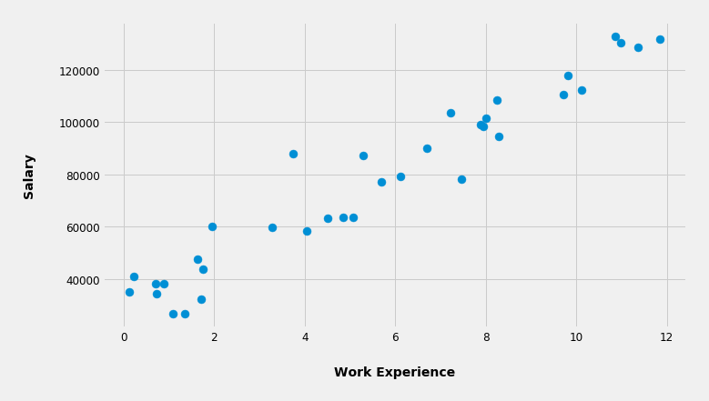
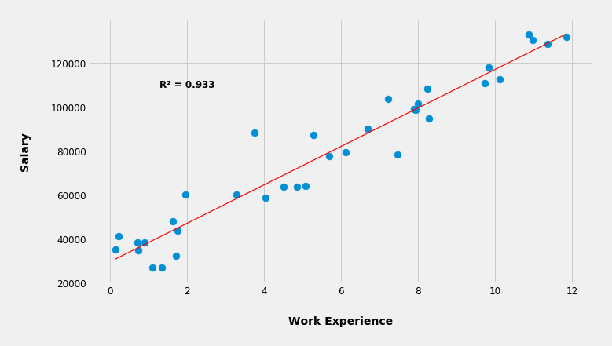
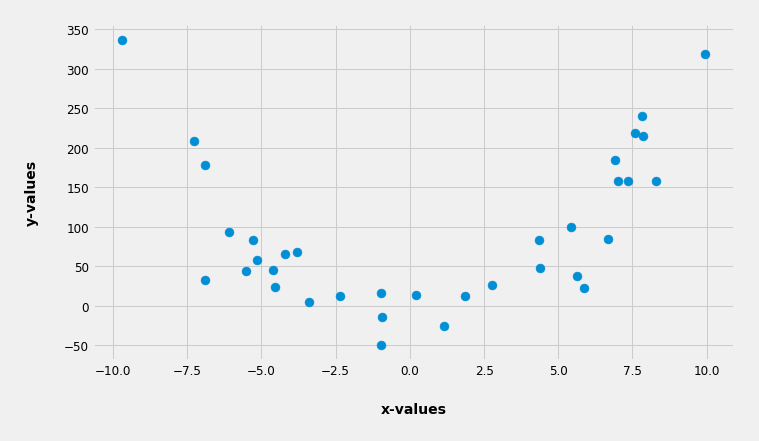
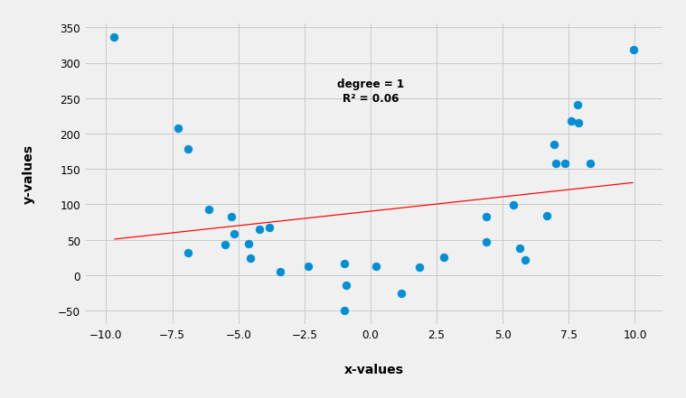
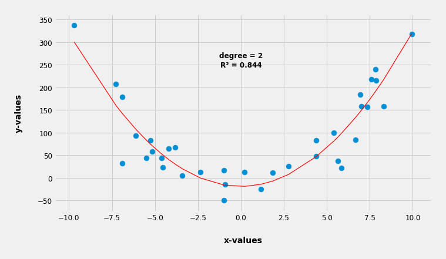
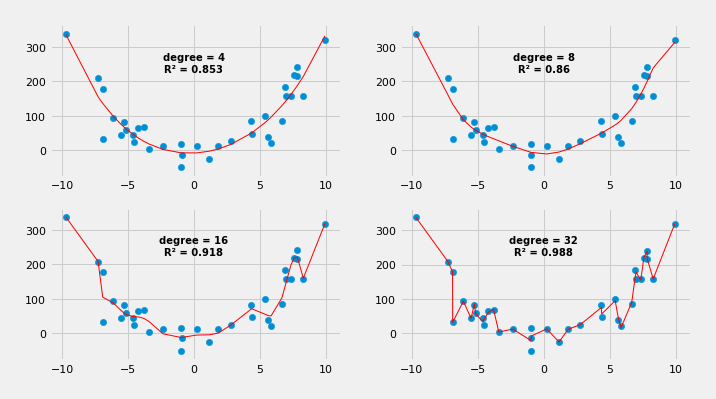

Machine learning (ML), simply put, is a way where an algorithm "reads"
the available data and then it "predicts" things when fed with brand new
unseen data of the same type. For example you know the weight and the
height of a bunch of people, the algorithm "sees" that data, and then
when you give to the algorithm some new, unseen weight of people, the
algorithm predicts their height with certainty of 80% let say. So the
algorithm "learned" and it can predict height of people knowing their
weight. Isn't that amazing?

The simplest possible explanation of how this works got to be the linear
regression explanation. I'll try to explain it here with some simple
examples and in my own words.

Let's imagine we have a group of people in some company and we happen
to know their work experience (in years) and their salaries (in dollars).
We can represent that data on a graph where the work experience is on
the **x-axis** and the salary on the **y-axis**. So every person will be
represented by a dot on this graph below.



Given this graph the algorithm will "ask itself" can I fit a curve in
between these dots such that the sum of the squared distances from the
dots to the curve will be minimal? Sure.

Can I also, by using some math, conveniently boil down the sum of those
squared distances as a number (**R²**) ranging from **0** to **1** such
that the bigger that number the better the fit of the curve? Sure.



In this case the curve happens to be a line. The mathematical
representation of a line is **y = ax + b**, where **a** is a slope defining
how steep the line is, and **b** is an intercept defining where the line
crosses the **y-axis**. In other words the line is in fact a polynomial
(a curve) with a degree of one, which means there are no exponents
in the equation, or in other words the largest exponent is one.

So for this particular example the algorithm produced a line with
approximately these values: **y = 9450x + 25792**.

Knowing this formula now the algorithm can generalize and "predict"
a salary when you give it a work experience. So when you ask the
algorithm, **"Hey, based on what you've learned so far what's the expected
salary with 9.2 years of experience?"**, the algorithm will answer
**"112,732 dollars, Sir."**, by plugging the **x** (which is 9.2) into the
formula and calculating the answer (**y**). The formula is now a MODEL
from which the ML algorithm can predict salaries based on the work
experience.

But what if the data is somewhat differently scattered.  

Here's such mysterious data:



So now if we ask the algorithm to fit a curve with a degree of one
(in fact a line) having the highest **R²** as possible (meaning the lowest
sum of squared distances as possible) it will look something like this:



As we can see the line in this case is very poorly fitted with **R² = 0.06**.
As a consequence this model will have a poor predictability and will
essentially be unusable. Even without knowing the **R²** we can easily
deduce the same thing just by looking at the graph. The line is nowhere
near fitted in between the dots.

Now instead of a line let's tell the algorithm to fit a parabola, a
quadratic function, which is represented with this equation
**y = ax² + bx + c**, which in fact is a polynomial (a curve) with a
degree of two (the largest exponent in the equation is two).



Lo and behold the algorithm fitted a parabola with **R² = 0.844**
which in this particular case is represented with:
**y = 3.4x² + 0.12x -19.05**

So again the algorithm generalized our data into a curve and now it
can predict **y-values** based on a brand new, never before
seen **x-values**.

But why stop there, why not try polynomials with a degree of
**4, 8, 16, 32**, etc.? Why not see if they can produce a better fit?
Let's do it.



Whoa, as we increase the degree of the polynomial the fitness of the curve
becomes better and better. In the last case where the degree is **32**
(that would be one badass formula) the curve is connecting almost all
of the dots. If we leave it there we can conclude that this last model
is the best.

But not so fast. What if we try these models and see how will they
predict the **y-values** when we give them new, never before
seen **x-values**?

So, if on our current, training data we train bunch of linear
regression models with the following degrees
**[1, 2, 3, 4, 5, 6, 7, 8, 9]**, but then if we additionally asses
them on a completely new **x-values** (new data), meaning calculating
how close their predicted **y-values** are close to the real,
observed **y-values**, then we will get the following values of
**R²** (derived both from the training data and from the new data)
in relation to the degree of the model.

```
degree = 1  |  training data R² = 0.060  |  new data R² = 0.057  
degree = 2  |  training data R² = 0.844  |  new data R² = 0.827  
degree = 3  |  training data R² = 0.846  |  new data R² = 0.831  
degree = 4  |  training data R² = 0.853  |  new data R² = 0.800  
degree = 5  |  training data R² = 0.855  |  new data R² = 0.796  
degree = 6  |  training data R² = 0.856  |  new data R² = 0.787  
degree = 7  |  training data R² = 0.857  |  new data R² = 0.779  
degree = 8  |  training data R² = 0.860  |  new data R² = 0.739  
degree = 9  |  training data R² = 0.876  |  new data R² = 0.587
```

As we can see the precision of the model when it comes to new data
doesn't increase indefinitely in relation to the degree of the
polynomial as is the case with the training data. Interestingly,
when we assess the predictability of the model with new data
(new **x-values**), there's a sweet spot at a **degree = 3**,
where **R² = 0.831** is the highest, which means the model
(the polynomial) with the degree of **3** will yield the most precise
predictions when it comes to real life data, not the one with a degree
of **32**.

The same applies for the more complex ML algorithms. You build a model
and then you test that model on a brand new data while fine tuning
different parameters (which can be many in the more complex ML algorithms).

So when you build a model you don't want to be underfitted nor overfitted,
but just the right amount of fitted. If it's underfitted it's way too
generalized and it will not be able to predict well when new data is
introduced. If it's overfitted it's made way too specific for the training
data, so it will be no good for a new data. The model needs to be robust
and just enough generalized in order to do well with new data.

As George E. P. Box said: **"All models are wrong, but some are useful."**


## Wrap up

I like to think that the above is possibly the simplest explanation of
how ML works. The data in the real world is rarely so simple. It is
multivariate, it has dozens if not hundreds of features, and we want
to extract different meanings from it. Therefore there is a multitude
of more complex ML algorithms but the underlying concept is roughly
the same. You want to make a model which will reliably predict,
recognize, group, and find patterns in data.


